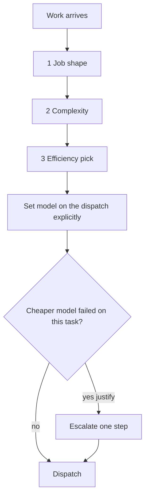

# Model Routing

**Goal:** best model for the job — quality ceiling first, then efficiency/token cost.
Not "always sonnet," not "always the parent chat," not habit.

An unset `model` on an Agent dispatch silently inherits the parent session's own
(top-tier) model — a burn vector. **Always set `model` explicitly** from this tree.

## Decision tree (three axes, in order)



1. **Job shape** — mechanical · implement/fix · review/judge · research · design/UX judgment · architecture/orchestration
2. **Complexity** — trivial · standard · hard · adversarial
3. **Efficiency** — cheapest model that still clears the quality bar; **raise effort on the current model before jumping models**; decompose so bulk is cheap and verify/judge is expensive

## Claude model map (defaults by cell)

| Cell | Default pick |
|---|---|
| Trivial / mechanical | `haiku` |
| Standard implement / fix / tests / most PR work | `sonnet` |
| Design/UX **implementation** against a locked Figma/spec | `sonnet` |
| Design/UX **taste / visual judgment** (no locked answer) | `opus` — justify |
| Research / competitive / cited facts | `sonnet` with tool access and a cited-retrieval evidence contract — never a "cheaper because cheaper" downgrade to haiku |
| Hard architecture / high blast radius | `opus` — justify |
| Adversarial review / refute | one tier **stronger than the implementer**: `opus` reviews a sonnet build; a sonnet build of trivial scope may take a sonnet reviewer, never weaker |
| Orchestration / parent synthesis | stays on the operator-chosen parent session — do **not** dispatch the top tier (fable/mythos) as a child |

Persona agent files keep persona defaults (mostly sonnet); **dispatch-time routing
overrides** when this tree says otherwise. Announce `"Persona (model): …"` with the
**actual** chosen model.

**Adversarial review:** **DO** put the reviewer at or above the implementer's tier;
**DON'T** spend opus on every routine review — opus reviews when the implementer was
already strong or the blast radius is high.

## Escalation rule

- Use a stronger model **from the start** when the cell requires it (adversarial judge, novel high-blast-radius architecture).
- Otherwise escalate only after a cheaper model **demonstrably failed** on this task. Record it in the brief ("sonnet run X produced Y, wrong because Z").
- "This is important" is not a justification — importance is evidence contract + reviewer gate, not spend.

## Checklist (extends dispatch-brief)

```
[ ] model set explicitly on the dispatch (never inherited)
[ ] job shape + complexity classified; pick from the Claude map above
[ ] if above sonnet / haiku: one-line justification (cell requires it, or cheaper model failed)
```

## Effort & scope

Model choice is one lever; effort, turn caps, and brief scope are the others.

- **Effort low** — mechanical stages (renames, formatting, known script + report).
- **Effort medium** — default for implement, fix, audit, research, tests.
- **Effort high** — adversarial verify/judge or competing-design scoring only; justify like a model escalation.
- **Every workflow spec sets `maxTurns`.** `workflow.mjs` defaults an unset agent to 60 turns (and an unset haiku agent to effort `low`) — a backstop, not a substitute for choosing a real number. `"maxTurns": null` must be explicit and is logged as a burn warning.
- **Scope the brief** so the child finishes in one coherent pass — prefer parallel Agent dispatches over one unbounded mega-agent. Single reviewer/verify pass is the default; multi-judge panels only when the task says thorough/audit.
- **Commit incrementally** in every implement brief so a long run never strands finished work.

## Soft token budgets (absorbed from model-efficiency)

A budget is a **soft ceiling → checkpoint**, not a hard kill. When crossed: stop and
reassess — right model? right approach? bigger task than its class?

| Task class | Checkpoint | If exceeded |
|---|---|---|
| Bulk / mechanical | Short pass; reclassify if still growing | Not mechanical — don’t just spend |
| Standard coding | One coherent PR-sized slice | Split or escalate model after a failed cheaper pass |
| Complex / craft / architecture | One full attempt at the justified model | Check the loop is productive before a 2nd expensive pass |
| UI / design **judgment** | Taste iteration burns fast | Get operator sign-off; don’t burn tokens guessing |
| Research | Open every cited URL | Conflict / SERP-only → fetch more primaries; never invent |
| Orchestration / brain | Name the run shape up front | Decompose into child Agent dispatches |

## Effort before model jump

Prefer *raising effort on the current model* before *jumping models* when the gap is
reasoning depth, not raw capability.

**Decomposition:** bulk edit on `haiku`/`sonnet` + final review on a stronger model beats
one expensive model over the whole run.

## Anti-triggers

- Trivial one-liner — no routing ceremony; do it on whatever is already loaded.
- Research never goes to a coding-cheap model “because it’s cheaper” — cited retrieval is the bar.
- Latency can justify a costlier/faster model — cost is not the only axis.
- Never leave model choice implicit for auditable fleet/ship dispatches.

## Historical burn lesson (2026-07-26)

One day burned heavily with **no turn/scope caps**, serial near-duplicate lanes, and
session collisions — not because the “wrong tier name” was chosen. Lesson: explicit
model + scoped briefs + parallel independent dispatches + turn caps + incremental
commits. `workflow.mjs` remains this plugin's runner — cap every agent in the spec.
