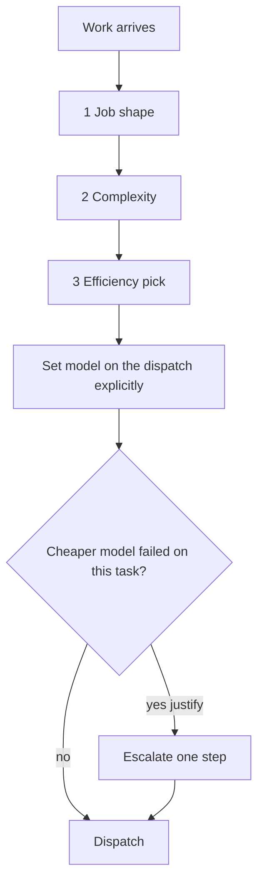

# Model Routing

**Goal:** best model for the job — quality ceiling first, then efficiency/token cost.
Not "always sonnet," not "always the parent chat," not habit.

An unset `model` on an Agent dispatch silently inherits the parent session's own
(top-tier) model — a burn vector. **Always set `model` explicitly** from this tree.

## Decision tree (three axes, in order)



1. **Job shape** — mechanical · implement/fix · review/judge · research · design/UX judgment · architecture/orchestration
2. **Complexity** — trivial · standard · hard · adversarial
3. **Efficiency** — cheapest model that still clears the quality bar; **raise effort on the current model before jumping models**; decompose so bulk is cheap and verify/judge is expensive

## Claude model map (defaults by cell)

**`sonnet` is the default ceiling for every dispatched doer, of every job shape.** `haiku`
covers mechanical work. `opus` requires a written justification in the brief's
`## Interrogated` block naming which of the two named cases below applies — operator
ruling 2026-09-21 (`sonnet-default-ceiling`): *"if there are types of work generally that
models perform best at and whether the right brief would mean sonnet should be absolutely
fine for most of the type of work we are currently doing across all sessions and projects.
should sonnet be the highest default?"* → *"Yes"*. No cell below defaults to opus outside
the two named cases.

| Cell | Default pick |
|---|---|
| Trivial / mechanical | `haiku` |
| Standard implement / fix / tests / most PR work | `sonnet` — **one contract unit per lane, always** (one export `COMPONENT_SET`, one captured page, one component): a brief covering more than one is **malformed at any model**, never a reason to escalate to `opus` (`dispatch-brief`) |
| Design/UX **implementation** against a locked Figma/spec | `sonnet` |
| Design/UX **taste / visual judgment** (no locked answer) | `sonnet` — grill for the lock instead of buying judgment with a bigger model; escalate only when the lane also meets one of the two opus cases below |
| Research / competitive / cited facts | `sonnet` with tool access and a cited-retrieval evidence contract — never a "cheaper because cheaper" downgrade to haiku |
| Architecture / orchestration | `sonnet` by default; `opus` only for **novel architecture with no contract to point at** — justify in `## Interrogated` naming this case |
| Adversarial review / refute | `sonnet`, at or above the implementer's tier; `opus` only for **adversarial review of a change with fleet-wide blast radius** — justify in `## Interrogated` naming this case; a sonnet build of trivial scope still takes a sonnet reviewer, never weaker |
| Orchestration / parent synthesis | stays on the operator-chosen parent session — do **not** dispatch the top tier (fable/mythos) as a child |

Persona agent files keep persona defaults (sonnet, the ceiling); **dispatch-time routing
overrides** when this tree says otherwise. Announce `"Persona (model): …"` with the
**actual** chosen model.

**Adversarial review:** **DO** put the reviewer at or above the implementer's tier, which
is `sonnet` by default; **DON'T** spend opus on a routine review — opus is limited to the
fleet-blast-radius case above, justified in the brief.

## Escalation rule

- `opus` is used **from the start** only for the **two named cases**: adversarial review of
  a change with fleet-wide blast radius, or novel architecture with no contract to point at —
  each requires a written justification in the brief's `## Interrogated` block naming which
  case applies. Every other cell starts at `sonnet` (mechanical work starts at `haiku`).
- Otherwise escalate only after a cheaper model **demonstrably failed** on this task **and the brief passed the dispatch-brief interrogation** (`dispatch-brief` § Interrogate the brief). A failed lane on an un-interrogated brief is a brief defect, not a model defect — fix the brief and re-run the same tier before escalating. Record the failure in the brief ("sonnet run X produced Y, wrong because Z").
- "This is important" is not a justification — importance is evidence contract + reviewer gate, not spend.
- **A wide brief is never an escalation.** Slice it into one-contract-unit lanes; the strongest model still misses what the brief never enumerated (operator ruling 2026-09-20, `accuracy-before-the-link`: *"You also used open on this task and outcome was sloppy"*).

## Checklist (extends dispatch-brief's eight-item list)

```
[ ] model set explicitly on the dispatch (never inherited)
[ ] job shape + complexity classified; pick from the Claude map above
[ ] sonnet is the default ceiling; if above sonnet: written justification in `## Interrogated` naming one of the two cases (fleet-blast-radius adversarial review, or novel architecture with no contract)
[ ] effort tier from the brief (routine | contested | high-stakes) mapped to model + thinking budget
```

## Effort tier — the brief's field, mapped here

Every dispatch brief names an **effort tier** (`dispatch-brief`). This table is where the
tier becomes a model and a thinking budget, so deliberation follows the work rather than
the parent's habit.

| Effort tier | The work | Model | Thinking budget |
|---|---|---|---|
| **routine** | Known shape, clear answer — mechanical edits, conform passes, a fix with a named cause | cheapest cell that clears the bar (`haiku`/`sonnet`) | **low** — no extended thinking |
| **contested** | Reasonable approaches disagree, or the claim will be argued — design-backed builds, diagnosis, adversarial review | `sonnet`, or `opus` when the cell above already requires it | **medium** — the default |
| **high-stakes** | Irreversible, cross-repo, or fleet-wide blast radius — releases, architecture, destructive migrations | `opus` — justify | **high** — justify like a model escalation |

The tier is chosen from the work, not from importance-feeling: "this matters" is an
evidence contract, not a budget. Raise the thinking budget on the current model before
jumping models.

## Effort & scope

Model choice is one lever; effort, turn caps, and brief scope are the others.

- **Effort low** — mechanical stages (renames, formatting, known script + report).
- **Effort medium** — default for implement, fix, audit, research, tests.
- **Effort high** — adversarial verify/judge or competing-design scoring only; justify like a model escalation.
- **Every workflow spec sets `maxTurns`.** `workflow.mjs` defaults an unset agent to 60 turns (and an unset haiku agent to effort `low`) — a backstop, not a substitute for choosing a real number. `"maxTurns": null` must be explicit and is logged as a burn warning.
- **Scope the brief** so the child finishes in one coherent pass — prefer parallel Agent dispatches over one unbounded mega-agent. Single reviewer/verify pass is the default; multi-judge panels only when the task says thorough/audit.
- **Commit incrementally** in every implement brief so a long run never strands finished work.

## Soft token budgets (absorbed from model-efficiency)

A budget is a **soft ceiling → checkpoint**, not a hard kill. When crossed: stop and
reassess — right model? right approach? bigger task than its class?

| Task class | Checkpoint | If exceeded |
|---|---|---|
| Bulk / mechanical | Short pass; reclassify if still growing | Not mechanical — don’t just spend |
| Standard coding | One coherent PR-sized slice | Split or escalate model after a failed cheaper pass |
| Complex / craft / architecture | One full attempt at the justified model | Check the loop is productive before a 2nd expensive pass |
| UI / design **judgment** | Taste iteration burns fast | Get operator sign-off; don’t burn tokens guessing |
| Research | Open every cited URL | Conflict / SERP-only → fetch more primaries; never invent |
| Orchestration / brain | Name the run shape up front | Decompose into child Agent dispatches |

## Effort before model jump

Prefer *raising effort on the current model* before *jumping models* when the gap is
reasoning depth, not raw capability.

**Decomposition:** bulk edit on `haiku`/`sonnet` + final review on a stronger model beats
one expensive model over the whole run.

## Anti-triggers

- Trivial one-liner — no routing ceremony; do it on whatever is already loaded.
- Research never goes to a coding-cheap model “because it’s cheaper” — cited retrieval is the bar.
- Latency can justify a costlier/faster model — cost is not the only axis.
- Never leave model choice implicit for auditable fleet/ship dispatches.

## Resumed context is a hidden token multiplier

Budget **per fresh dispatch**, not per resume: a resumed agent pays full inference cost
against its entire prior transcript on every turn, so the same task grows slower and
pricier with each resume with no change in the task's own size (`fresh-context-per-task`,
2026-09-16). Resume is reserved for a reviewer's red on the sha it just built; every other
follow-up — a new ruling, a widened lock, a continuation slice, round two — is a fresh
`Agent`, budgeted as its own dispatch.

## Historical burn lesson (2026-07-26)

One day burned heavily with **no turn/scope caps**, serial near-duplicate lanes, and
session collisions — not because the “wrong tier name” was chosen. Lesson: explicit
model + scoped briefs + parallel independent dispatches + turn caps + incremental
commits. `workflow.mjs` remains this plugin's runner — cap every agent in the spec.
